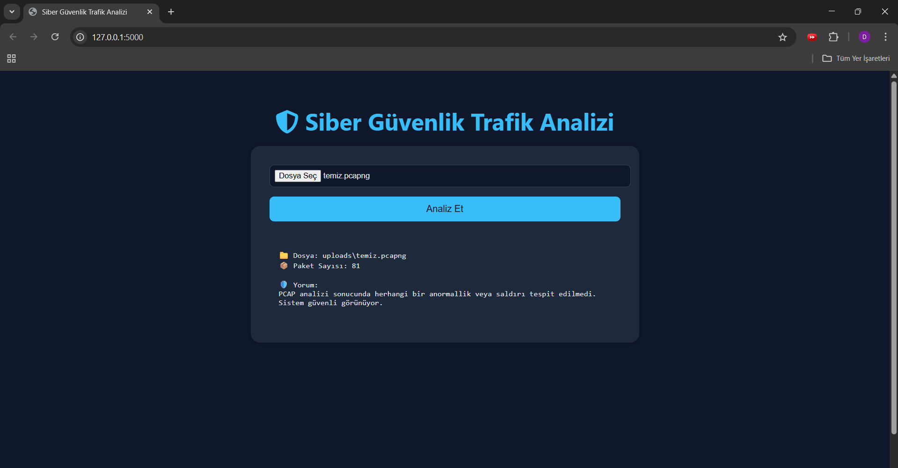
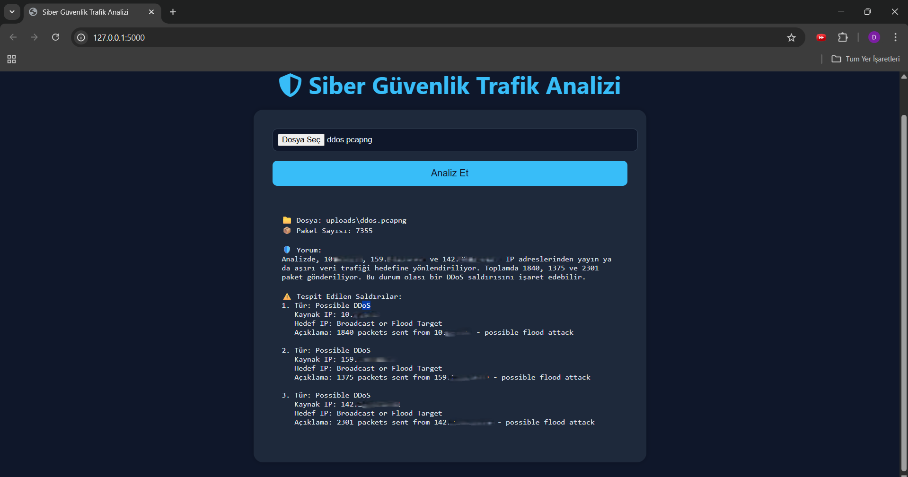
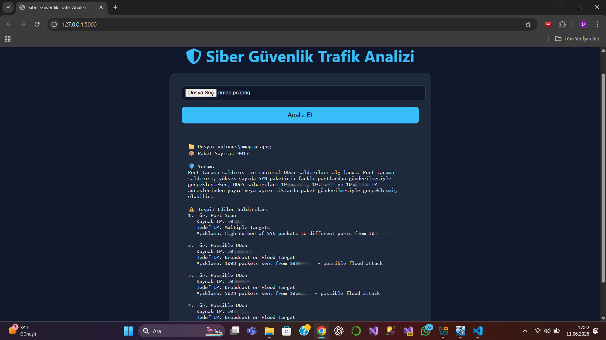
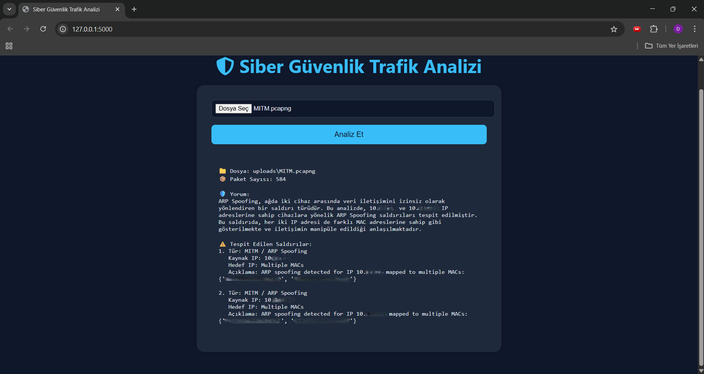
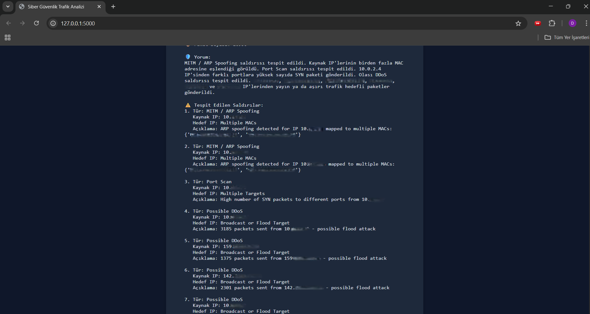

# Siber Güvenlik Trafik Analizi

Bu proje, Wireshark gibi araçlarla kaydedilmiş ağ trafiği (`.pcap`/`.pcapng`) dosyalarını analiz ederek olası siber saldırı belirtilerini tespit eden ve sonuçları yapay zeka (LLM) ile kullanıcı dostu bir dilde yorumlayan web tabanlı bir sistemdir. Hazırlanan web sayfası yapay zeka yardımı ile hazırlanmış olup web sitesi üzerinde test edilmesi için alınan .pcap dosyaları kendi oluşturduğum bir sanal makineye yaptığım siber saldırılar sonucu alınmış ve bu saldırı anlarda Wireshark üzerinden oluşturulan .pcap dosyaları olup tamamı legal olarak şahsım tarafından Linux kullanlarak yaptığım saldırılar sonucu oluşan dosyalardır.

## 🎯 Proje Amacı

Bu projenin temel amacı, ağ trafiği kayıtlarından olası siber saldırı belirtilerini otomatik olarak analiz eden bir sistem geliştirmektir. Sistem, teknik analiz sonuçlarını bir yapay zeka modeli (LLM) aracılığıyla herkesin anlayabileceği, doğal bir dilde yorumlayarak sunar.Bu sayede, teknik bilgisi olmayan kullanıcılar bile ağlarındaki şüpheli aktiviteler hakkında bilgi sahibi olabilir.

## ✨ Özellikler

- **Dosya Yükleme:** Kullanıcılar, tarayıcı üzerinden `.pcap` veya `.pcapng` uzantılı ağ trafiği kayıt dosyalarını kolayca sisteme yükleyebilir.
- **Otomatik Analiz:** Yüklenen dosyadaki paketler sayılarak IP, TCP, ARP, ICMP gibi temel protokoller incelenir.
- **Saldırı Tespiti:** Aynı IP'den çok sayıda porta yapılan taramalar (Port Scan), ARP tablosu zehirleme girişimleri (ARP Spoofing) gibi şüpheli durumlar otomatik olarak tespit edilir.
- **Yapay Zeka Destekli Yorumlama:** Tespit edilen tüm teknik bulgular ve anormallikler, OpenAI GPT-3.5 modeline gönderilerek analiz edilir ve kullanıcıya metinsel bir özet olarak sunulur.
- **Detaylı Raporlama:** Anormal bir durum tespit edildiğinde, ilgili paketlere ait bilgiler filtrelenerek raporda gösterilir.

## 🛠️ Kullanılan Teknolojiler

- **Backend:** Python & Flask
- **Paket Analizi:** Scapy
- **Yapay Zeka Yorumlama:** OpenAI GPT-3.5 API
- **Frontend:** HTML / CSS
- **API Anahtar Yönetimi:** python-dotenv

## 📸 Ekran Görüntüleri

### ✅ Temiz Trafik Analizi

### ❌ DDOS Saldırı Testi

### 🔍 Port Tarama Testi

### 🔐 MITM (ARP Spoofing) Testi

### 💥 Birden Fazla Saldırı Testi

## 🛡️ Tespit Edilebilen Saldırılar

| Saldırı Türü            | Açıklama                                                          |
| :---------------------- | :---------------------------------------------------------------- |
| **SYN Flood (DDoS)**    | Aynı hedefe aşırı sayıda TCP SYN paketi gönderilmesi.             |
| **Port Scan**           | Tek bir kaynak IP'den hedefin farklı portlarına tarama yapılması. |
| **ARP Spoofing (MITM)** | ARP tablosunu zehirleyerek ağdaki iletişimi dinleme girişimi.     |
